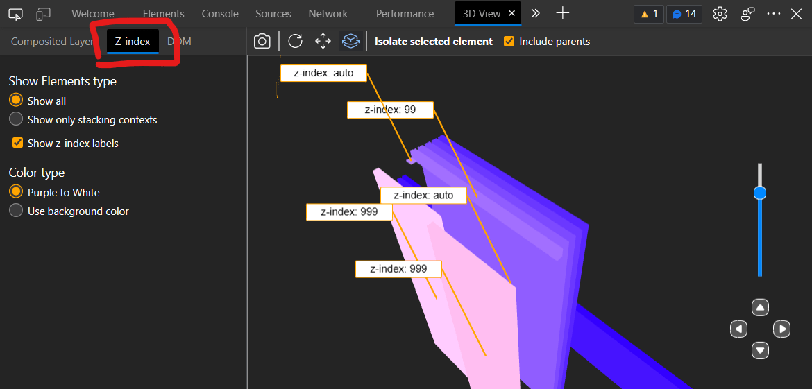
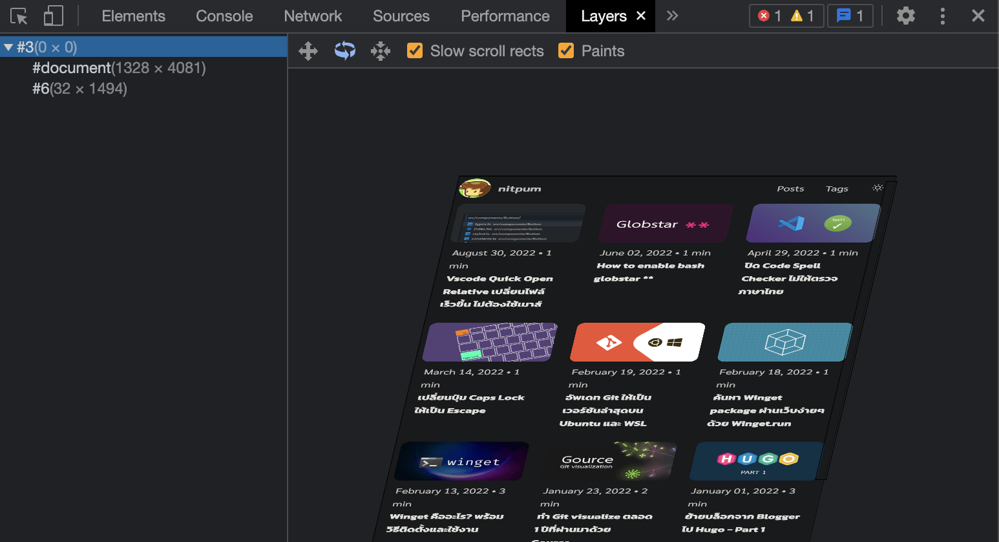

ปกติแล้ว z-index ถ้าเป็นเว็บทั่วไปเราอาจจะไม่ได้ใช้มันบ่อยเท่าไร ใช้ทีก็ไม่ได้กำหนด index เยอะมาก ตอน debug เลยไม่ค่อยมีปัญหาเท่าไร

แต่บางทีเราใช้ component จาก library นอกที่เราควบคุม z-index ไม่ได้ ทำให้ debug ยากว่าใช้ z-index เท่าไรบ้าง หรือแม้แต่โค้ดที่เราเขียนเองแก้ z-index ไปแล้วทำไมยังโดนทับอยู่ มานั่งคิดๆ เอาเองมันก็เห็นภาพยากอยู่ดี

ดีที่ว่าใน Microsoft Edge มีตัว 3D View เลยทำให้ debug z-index ง่ายเห็นภาพชัดกว่าด้วยว่าอะไรอยู่ตรงไหน ทับกันยังไงบ้าง โพสต์นี้เลยจะแชร์ว่ามันใช้งานยังไง

## วิธีใช้ Microsoft Edge 3D View

1. อันดับแรกเปิด Developer tools ขึ้นมาด้วย `Ctrl/Cmd + Shift + I`
2. กดเครื่องหมาย `+`
3. เลือก `3D View`



4. ด้านซ้ายมือจะมีแท็บอยู่ให้กดไปที่ `Z-index` เท่านี้เราก็จะดูได้แล้วว่า element แต่ละอันอยู่ z-index ไหนบ้าง

ส่วนวิธีควบคุมก็กดด้านบนเพื่อสลับไปโหมดเลื่อนตำแหน่งกับหมุนกล้องได้เลย นอกจากนี้ถ้าเราคลิก element ไหน ก็จะพาเราไปดู source ของ element นั้นด้วย ช่วยให้เรา debug css ได้ง่ายขึ้น



## Chromium-based browser

ถึงแม้ตัว Microsfot Edge ตัวใหม่นี้จะ based on Chromium แต่น่าเสียดายที่บรรดาบราวเซอร์ในตระกูล chromium เหมือนกันกลับยังไม่มีฟีเจอร์นี้แม้แต่ตัว Google Chrome เองก็ตาม มีใกล้เคียงสุดก็ `Layers` ซึ่งมันก็คือแท็บ Composited Layers ใน 3D View ของ Edge นั้นเอง

## Firefox ละ?

ถ้าจำไม่ผิด Firefox น่าจะเป็นเจ้าแรกเลยมั้งที่ใส่ฟีเจอร์นี้เข้ามาในตัวบราวเซอร์ เพราะแต่ก่อนใช้บ่อยมาก น่าเสียดายที่ตั้งแต่ Firefox 47 เป็นต้นไปฟีเจอร์นี้ดันโดนเอาออกไปซะแล้ว 😢


