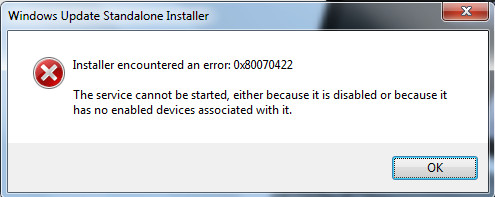

## สาเหตุ

สำหรับใครที่กำลังจะติดตั้งหรือใช้งาน Discord แล้วเจอปัญหา Error **"KERNELL32.Dll"** สามารถแก้ปัญหานี้ได้ง่ายๆ ครับเพียงแค่ดาวน์โหลดอัพเดทระบบของวินโดมาลงครับ

## ลิงก์ดาวน์โหลด

สำหรับคอม 32bit: [https://www.microsoft.com/en-us/download/details.aspx?id=26767](https://www.microsoft.com/en-us/download/details.aspx?id=26767)  
สำหรับคอม 64bit: [https://www.microsoft.com/en-us/download/details.aspx?id=26764](https://www.microsoft.com/en-us/download/details.aspx?id=26764)

กดเข้าไปตามลิงก์ด้านบนจากนั้นเลื่อนลงมาข้างล่าง กดที่ปุ่ม Download เมื่อโหลดเสร็จก็กดติดตั้ง  
หลังจากติดตั้งเสร็จแล้วก็สามารถติดตั้งหรือเข้า Discord ได้เลยครับ :)

## ปัญหา Error: 0x80070422

บางท่านเมื่อกดติดตั้งตามขัั้นตอนด้านบน อาจจะเจอปัญหา error: 0x80070422 ขึ้นมา เกิดจากการที่ตัว Services ของ Windows Update ถูกปิดอยู่จึงไม่สามารถติดตั้งอัพเดทได้ครับ

### วิธีแก้

1.  เปิด Start menu ขึ้นมา
2.  พิมพ์ค้นหาว่า Services กดเปิดขึ้นมา
3.  เมื่อเปิดขึ้นมาจะมีรายชื่อ Services ต่างๆ ให้หา **Windows Update**
4.  คลิกขวาที่ Windows Update กด **Properties**
5.  ในแท็บ General ให้ดูแถวๆ ด้านล่าง **Startup type** เปลี่ยนเป็น **Automatic**
6.  กด ok
7.  รีสตาร์ทเครื่อง

หลังจากรีสตาร์ทเครื่องแล้วก็เสร็จแล้วครับ ทีนี้เมื่อกดติดตั้งไฟล์อัพเดทก็จะไม่เจอปัญหา error: 0x80070422 แล้วครับ

หากใครพบปัญหาอื่นหรืออยากสอบถาม คอมเม้นทิ้งไว้ด้านล่างได้เลยครับ :)
