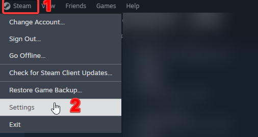
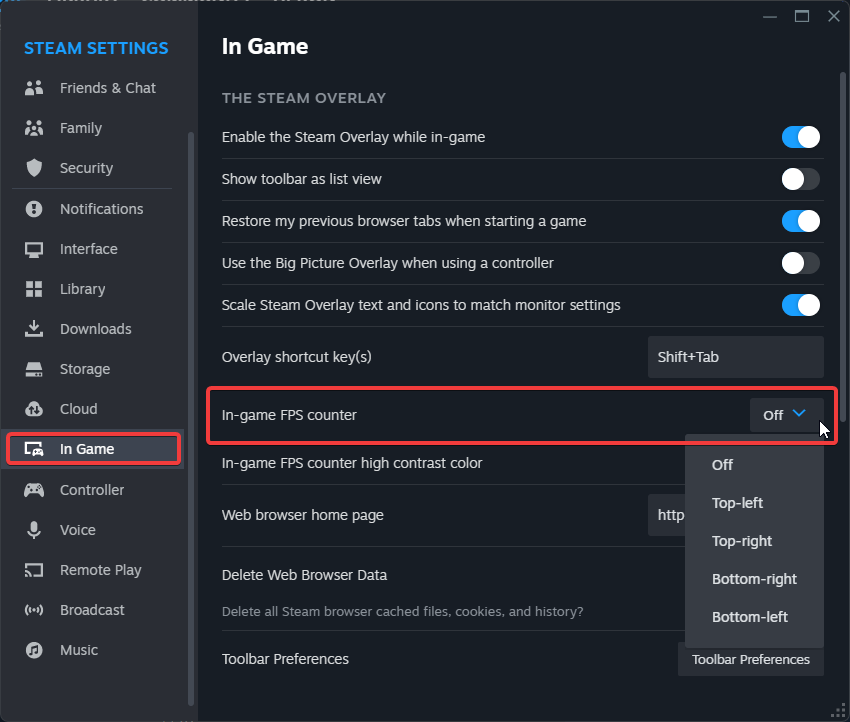
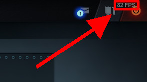

"FPS" หรือ "Frames per second" คือ จำนวนเฟรมภาพที่แสดงต่อหนึ่งวินาที การเล่นเกมจะให้ดีควรมี FPS ในระดับที่พอเหมาะที่เครื่องคอมพิวเตอร์ของเรารับได้ ไม่ควรน้อยเกินไปหรือมากเกินไป เพราะอาจทำให้กินทรัพยากรในเครื่องเราหรือภาพกระตุกได้  
เกมบางเกมนั้นมีตัวเลือกให้ตั้งค่าแสดง FPS ได้ในตัว ซึ่งเกมส่วนใหญ่นั้นไม่มี แต่ Steam นั้นมีฟังชั่นพิเศษที่สามารถแสดง FPS บนเกมที่เล่นผ่าน Steam ได้ทุกเกม

## วิธีแสดง FPS เกมบน Steam

1.  คลิกที่เมนู "Steam" ด้านซ้ายบนของโปรแกรม
2.  คลิกเมนู "Settings" (ภาษาไทย "การตั้งค่า")

    

3.  จะมีหน้าต่างการตั้งค่าขึ้นมา
4.  คลิกที่ "In-Game" (ภาษาไทย "ในเกม")
5.  ดูที่ "In-game FPS counter" (ภาษาไทย "แสดงโอเวอร์เลย์ตรวจสอบประสิทธิภาพ")  เลือกตำแหน่งที่ต้องการให้ FPS แสดงในเกม  
    
    ใครต้องการให้แสดงตรงไหนเลือกได้ตามใจชอบเลยครับ โดยจะมีตัวเลือกให้ดังนี้
    - **Off/ปิด**: ปิดการแสดง FPS
    - **Top-left/บนซ้าย**: แสดง FPS ด้านซ้ายบน
    - **Top-right/บนขวา**: แสดง FPS ด้านขวาบน
    - **Bottom-right/ล่างขวา**: แสดง FPS ด้านขวาล่าง
    - **Bottom-left/ล่างซ้าย**: แสดง FPS ด้านซ้ายล่าง
6.  ลองกดเข้าเล่นเกมดูครับ ของผมเลือก Top-right (ด้านขวาบน) จะได้หน้าตาประมาณนี้ครับ

    

ถึงแม้เกมนั้นจะไม่มีตัวเลือกให้เราตั้งค่าก็ตาม ขอเพียงแค่เกมนั้นเล่นผ่านระบบของ Steam เท่านี้เราก็มี FPS แสดงให้เราเห็นได้แล้วครับ 🙂 ใครมีความคิดเห็น หรือขอเสนออะไร สามารถคอมเม้นได้ด้านล่างเลยครับ
