ช่วงนี้ผมกำลังมองหาโฮสต์ฝาก Static Website แบบฟรีๆ มาลองเล่นอยู่ ว่าจะเอาไปสำรองไว้เผื่อเลิกเขียนบล็อกจาก Blogspot ย้ายไป [Hexo](https://hexo.io/) จะได้มีที่ฝากบล็อก จริงๆ ก็ใช้ [Github Pages](https://pages.github.com/) ได้อยู่ครับ แต่มันค่อนข้างช้าแถมมีข้อจำกัดอยู่พอสมควร บวกกับอย่างลองของใหม่ด้วย XD

เลยไปลองค้นในกูเกิ้ลดูว่ามีที่อื่นอีกไหมก็เจออยู่หลายตัวเลยครับ แต่ผมชอบ  [Netlify](https://www.netliy.com/)  ที่สุดครับเลยยกมาเขียนในบทความนี้ ส่วนตัวอื่นๆ ไว้ค่อยเขียนอีกทีครับ

## พื้นฐานที่ควรมีก่อนอ่านบทความนี้

- การเขียนโค้ด HTML และ CSS
- รู้วิธีใช้งาน Git และ Github เบื้องต้น

## รู้จัก Netlify

หลายคนอาจจะเคยเห็นหรือเคยได้ยินชื่อนี้กันมาบ้างแล้ว แต่อาจจะยังไม่รู้หรือสงสัยว่า Netlify คืออะไร Netlify เป็นโฮตส์ฝากเว็บไซต์แบบ Static ที่ออกแบบและเน้นอำนวยความสะดวกให้เหล่า developer ใช้งาน การใช้งาน Netlify จึงใช้พวก command line เป็นหลักครับ

นอกจากนี้แล้วยังมีฟีดเจอร์ต่างๆ มากมายให้เราใช้งานกันอีกด้วยครับ ส่วยรายละเอียดฟีดเจอร์เต็มๆ นั้นดูได้ที่ [ลิงก์](https://www.netlify.com/features/)

**Netlify ให้ CDN ฟรี!** ใช้ครับอ่านไม่ผิดครับ Netlify ให้เว็บเราใช้งาน CDN ได้ฟรีครับ ถ้าใครไม่รู้จัก CDN(Content Delivery Network) หรือถ้าพูดง่ายๆ ก็คือระบบเครือข่ายที่กระจายข้อมูลเว็บไปยังทั่วโลก ทำให้เว็บเราสามารถเข้าจากที่ไหนก็ได้ในโลกได้อย่างรวดเร็วนั้นเองครับ

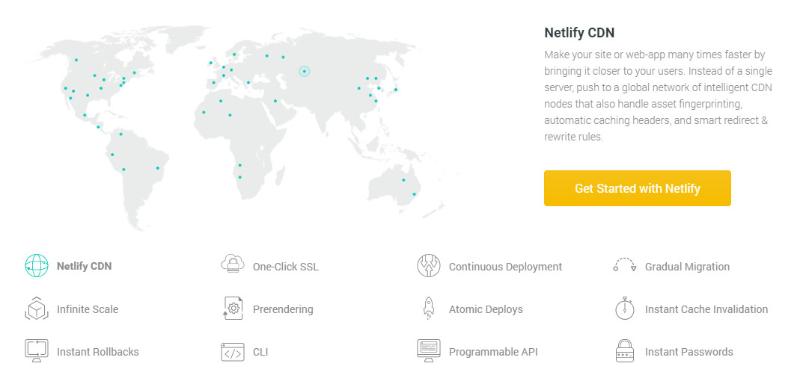

นอกจากนี้ยังมี **SSL(Let's Encrypt) ให้เราฟรีอีกด้วย** และเมื่อเราเปิดใช้งาน SSL จะส่งข้อมูลผ่าน **HTTP2** ทำให้เว็บเราเร็วสุดๆ ไปเลยครับ แถมยังมีระบบประวัติเวอร์ชั่นเว็บเรา ที่ให้เราย้อนเว็บกลับไปเป็นแบบเก่าได้อีกด้วย นอกจากนี้เว็บที่ใช้ **static site generator** ไม่จำเป็นต้องสั่ง build เอง แต่ให้ Netlify สั่ง build แทนและอัพขึ้นเน็ตให้ทันที

ทางด้านราคาสำหรับโปรฟรีถือว่าโอเคครับ มีฟีดเจอร์พื้นฐานให้ครบถ้วน ถ้าใครอยากฟีดเจอร์อื่นๆ เพิ่ม เช่น Advance Proxy Rule กับ Prerendering ต้องเสียเงินครับ [ดูรายละเอียดเรื่องราคา](https://www.netlify.com/pricing/)

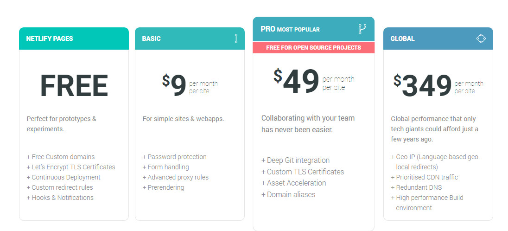

ส่วนเรื่องขอจำกัด พวกแบรดวิด กับ ขนาดของเว็บ ก็ตามนี้เลยครับ  
โปรฟรีได้ แบรดวิน 100GB/เดือน และขนาดเว็บสูงสุด 100GB  ถือว่าเยอะพอสมควรครับ  
สำหรับเว็บไซต์ธรรมดาและเว็บบล็อกแค่นี้ก็เพียงพอแล้วครับ [ดูข้อมูลเต็ม](https://www.netlify.com/tos/)

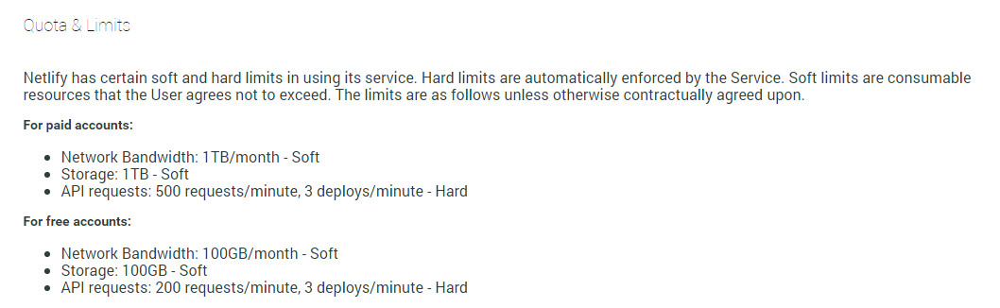

## เริ่มใช้งาน

เอาละครับเรามาเริ่มต้นฝากเว็บไว้กับ Netlify กันดูเลยดีกว่า โดยวิธีการฝากเว็บเรานั้นก็มีอยู่ด้วยกัน 3 วิธีครับได้แก่

1.  ฝากโค้ดได้กับ Git Hosting (เช่น Github, Bitbucket, Gitlabs เป็นต้น ) แล้วให้ Netlify ดึงไปอีกที
2.  อัพโค้ดลง Netlify โดยตรงผ่าน [CLI (Command line interface) ของ Netlify](https://www.netlify.com/docs/cli/)
3.  อัพโค้ดลง Netlify โดยตรงทางเว็บบราวเซอร์

ในบทความนี้ผมเลือกที่จะใช้วิธีที่หนึ่งนะครับ เพราะเป็นวิธีที่ไม่ต้องติดตั้งอะไรเพิ่ม และคงคุ้นเคยอยู่แล้วสำหรับคนที่เคยใช้ Github Pages แถมเวลาเรามี commit ใหม่ Netlify ก็จะอัพเดทให้เราเลยครับ

อย่างแรกเราต้องสร้าง Repo ของเว็บเรากันก่อนครับ ในตัวอย่างนี้ผมฝากไว้กับ Github ครับ ใครจะใช้ Bitbucket หรือ Gitlab ก็ได้นะครับ สามตัวนี้ Netlify เชื่อมได้หมดครับ

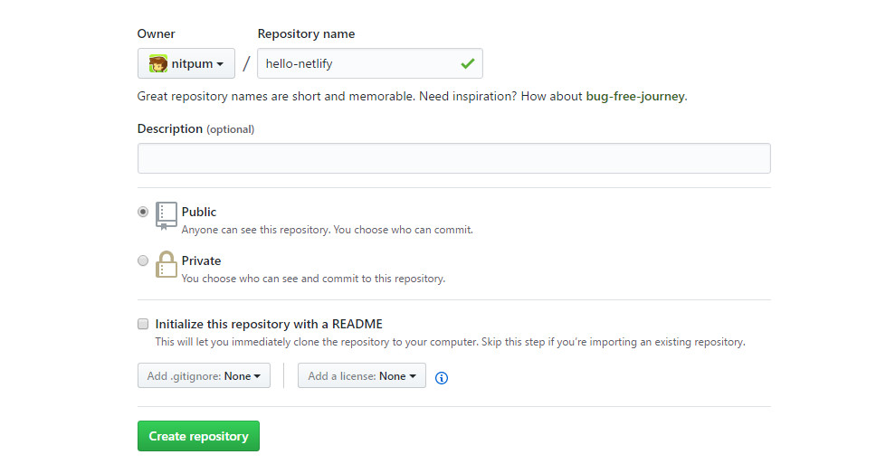

หลังจากนั้นก็โคลนโปรเจคเราลงมา

```bash
git clone https://www.github.com/username/hello-netlify
```

แล้วก็สร้าง index.html กันครับ

```html
<!DOCTYPE html>
<html>
    <head>
        <title>Hello Netlify !</title>
        <style>
            *{-webkit-box-sizing:border-box;-moz-box-sizing:border-box;-ms-box-sizing:border-box;box-sizing:border-box}body,html{height:100%}body{background:#f4f6f6;font-family:Roboto,sans-serif;color:#414546;display:flex;align-items:center;justify-content:center}p{margin:20px 0}.panel{background:#eee;padding:40px 60px;border-radius:6px;width:40em;margin:50px auto;max-width:100%}a,a:active,a:link,a:visited{color:#35a65e;text-decoration:none}a:hover{text-decoration:underline}
        </style>
    </head>
    <body>
        <div class="panel">
            <h1>Nothing here !</h1>
        </div>
    </body>
</html>
```

เสร็จแล้วก็ commit และ push เลยครับ

```bash
git add "index.html"
git commit -m "Add index.html"
git push -u origin master
```

## เชื่อม Repo เข้ากับ Netlify

ต่อไปเราก็จะเชื่อม Netlify เข้ากับ Repo เว็บเราครับ  
ขั่นแรกก็ล็อคอินเข้า Netlify ตามลิงก์นี้ครับ [Login](https://app.netlify.com/)

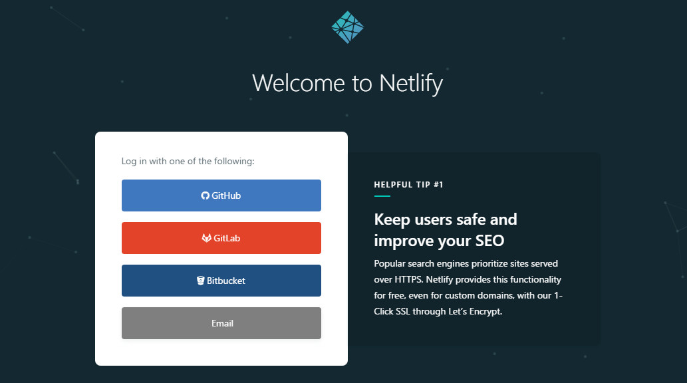

พอเข้ามาหน้า Dashboard แล้วกด "New site from git" จะเข้ามาหน้า Create a new site ครับ

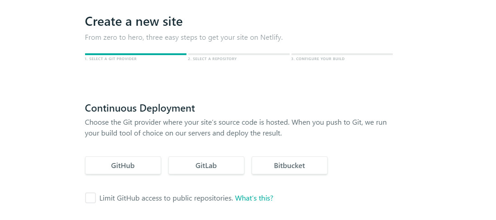

ในหน้านี้จะให้เราเลือกว่าจะเอา Repo จากที่ไหนซึ่งก็มี GitHub, GitLab และ Bitbucket ด้วยกันครับ  
แน่นอนว่าตัวอย่างนี้เราเอา Repo ฝากไว้กับ Github ขั้นตอนนี้เราจึงเลือก Github ครับ

ถ้าใครต้องการให้ Netlify อ่านแค่ public repo ก็ ติ๊ก ตรงช่อง Limit GitHub access เลยครับ

ในขั้นตอนนี้ไม่ได้หมายความว่าเราเลือก Github แล้ว เว็บต่อไปของเราจะต้องใช้ Github นะครับ จะใช้ตัวอื่นก็ได้ครับ เช่น  
เว็บ A ใช้ Github  
เว็บ B ใช้ Gitlab  
เว็บ C ใช้ Bitbucket  
ทาง Netlify จะถามเราทุกครั้งเวลาสร้างเว็บใหม่ครับว่าจะให้ดึง Repo จากที่ไหนครับ

เสร็จแล้วจะมีหน้าต่างยืนยันสิทธิให้ Netlify อ่าน Repo ของเราขึ้นมา กดปุ่ม "Authorize application" เลยครับ

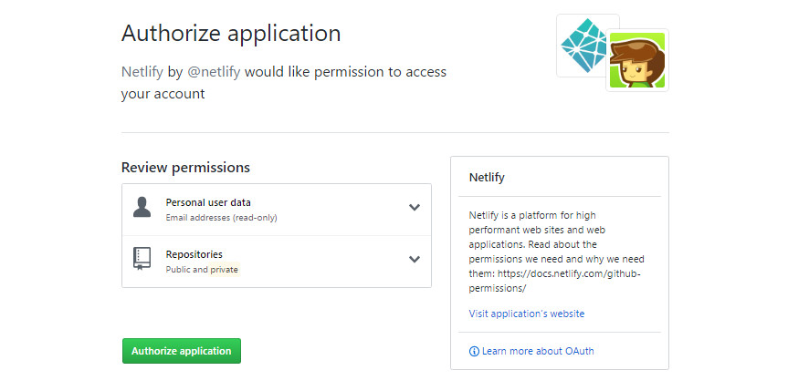

จากนั้นจะมีรายชื่อ Repo ทั้งหมดขึ้นมา กดเลือก Repo ของเว็บเราครับ

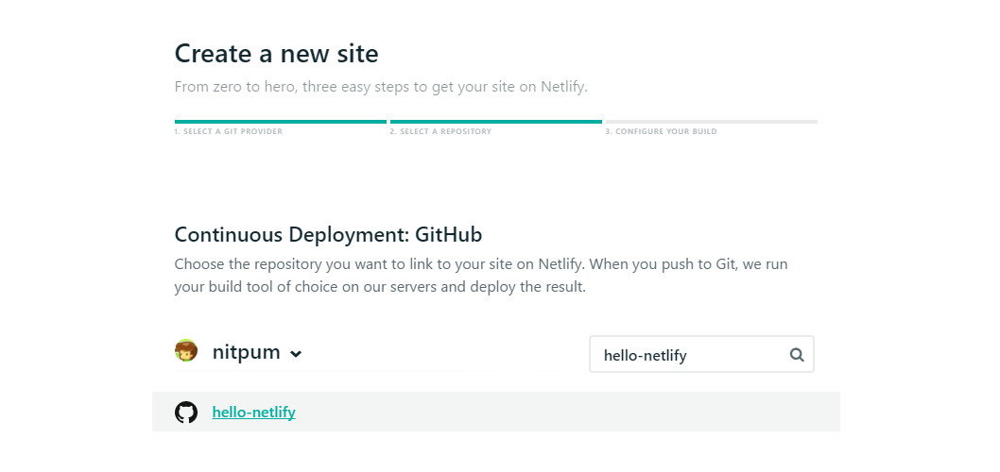

ขั้นตอนต่อไปจะเป็นการตั้งค่าพื้นฐาน

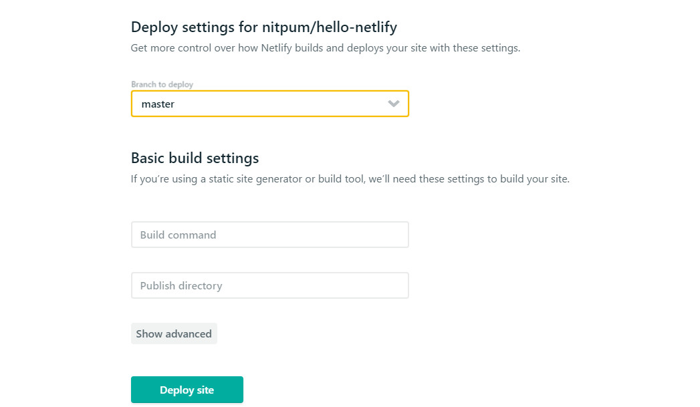
### Branch to deploy

เลือก branch ที่เราต้อง deploy ครับ ใครที่มี branch อยู่หลายอันให้เลือกอันที่เราใช้ดีพลอยครับ  
(ตรงนี้เหมาะมากสำหรับ static site generator ครับ เช่น มี branch เก็บซอสโค้ด กับ branch ที่ใช้ดีพลอยแยกกัน)  
ในบทความนี้เรามีแค่ branch เดียวครับคือ master ครับ เพราะฉนั้นไม่ต้องเลือกอะไรครับ

### Basic build settings

สำหรับคนที่ใช้ static site generator ที่ต้องการอัพแค่ซอสโค้ดแล้วให้ Netlify ไป build ให้ก็กำหนดคำสั่งลงในช่อง Build command ครับ เช่น jeklly build เป็นต้น [อ่านวิธีใช้งาน](https://www.netlify.com/docs/continuous-deployment/)  
ในบทความนี้เป็นแค่เว็บ HTML ธรรมดาครับ ส่วนนี้จึงข้ามไป

กดปุ่ม "Deploy site" ได้เลยครับ

เสร็จแล้วเราจะมาโผล่หน้าประมาณนี้ครับ ด้านล่างจะมี log การ deploy ให้เราด้วย  
ส่วนด้านบนจะมีลิงค์กดดูหน้าเว็บเราครับ

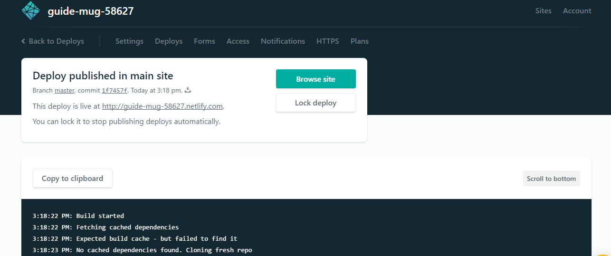

และเมื่อกดเข้าลิงก์เว็บเรา... เย้ ! ตอนเว็บเราตอนนี้อยู่บน Netlify แล้วครับ  
ต่อไปเราจะมาลองอัพเดทหน้าเว็บดูกันครับ

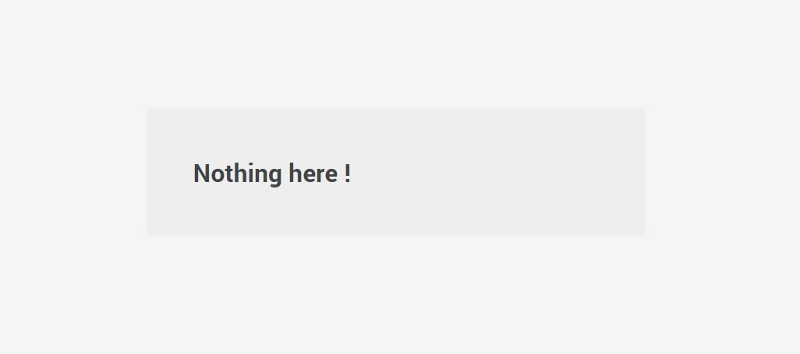

## อัพเดทหน้าเว็บ

หลังจากเว็บเราอยู่บน Netlify แล้ว ทีนี้ผมจะมาลองเปลี่ยนข้อความหน้าเว็บดูกันนะครับ  
ผมจะเปลี่ยนข้อความตรง panel ใหม่ครับ

```html
<div class="panel">
    <h1>Hello Netlify | nitpum</h1>
    <a href="https://nitpum.com">← Back to main site</a>
</div>
```

เสร็จแล้วก็ commit และ push ครับ  
```bash
git add "index.html" 
git commit -m "Update index.html" 
git push origin master 
```

ลองกลับไปดูหน้า Deploys จะเห็นว่า Netlify ดึงคอมมิดใหม่ให้เราแล้วครับ

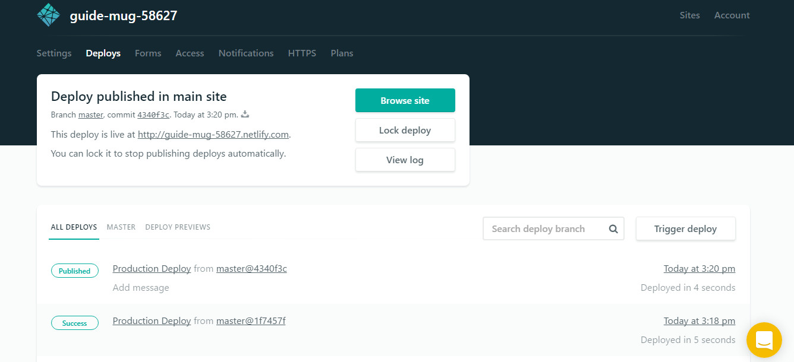

ลองกดดูเว็บเราใหม่อีกที... เย้ ! หน้าเว็บเราอัพเดทแล้วครับ

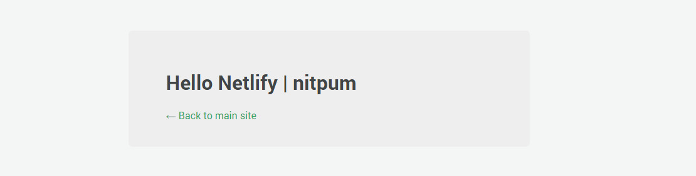

## เปลี่ยนชื่อเว็บไซต์

หากลองสังเกตุจะเห็นว่าตอนนี้เว็บของเรานั้นใช้ซับโดเมนของ Netlify อยู่ด้วย (`nitpum-hello-AXbLk23.netlify.app`)
แต่ว่าซับโดเมนที่ให้มามันเป็นข้อความสุ่ม ซึ่งไม่เท่เอาซะเลย...  
วิธีการเปลี่ยนซับโดเมนนั้นก็ง่ายๆ ครับ เพียงแค่กดที่

**Site settings -> Domain management -> Domain -> กดปุ่ม Options -> Edit site name -> พิมพ์ชื่อที่เราต้องการลงไป -> Save**  แค่นี้เรียบร้อยแล้ว

แต่ตอนนี้จะเห็นว่าเว็บเรานั้นเข้าได้ทั้ง http และ https นะครับ ถ้าจะให้เข้า http แล้วเปลี่ยนเป็น https เองต้องกำหนด Custom domain ครับก่อนครับ ซึ่งบทความนี้ผมขอยังไม่พูดถึง แต่สามารถอ่านเพิ่มเติมได้ตาม [ลิงก์](https://www.netlify.com/docs/custom-domains/) นี้ครับ

เพียงเท่านี้เราก็ได้เว็บไซต์ของเราแล้ว ทั้งเร็วและมี SSL ด้วยครับ :)  
ยังไงถ้าใครมีความคิดเห็นหรือข้อเสนอแนะนำอะไรก็ทิ้งไว้ด้านล่างได้เลยครับ
