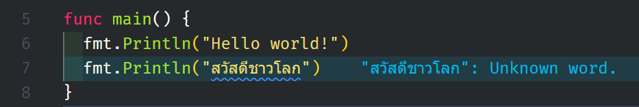

ใน VSCode มี extension [Code Spell Checker](https://marketplace.visualstudio.com/items?itemName=streetsidesoftware.code-spell-checker) ไว้สำหรับตรวจคำผิดภาษาอังกฤษ ปัญหาคือ extension นี้ยังไม่ได้ทำมาให้รองรับภาษาไทย ทำให้เวลาเปิดโปรเจคที่มีภาษาไทยตัว extension จะไม่รู้จักและคิดว่าเป็นคำผิด แล้วคอยขึ้นเตือนเราอยู่ตลอดเวลา



## วิธีแก้

แต่ปัญหานี้จะหมดไปถ้าเราตั้งให้ ignore ภาษาไทยไว้ด้วยการใส่ Regex `/[\\u0E00-\\u0E7F]/g`

1. เปิด User settings ขึ้นมา (Windows/Linux กด `Ctrl` + `,` macOS กด `Cmd` + `,`)
2. ค้นว่า "C Spell Ignore Reg"
3. ตรง C Spell: Ignore Reg Exp List กด Add item
4. เพิ่ม `/[\\u0E00-\\u0E7F]/g` เข้าไป
5. กด Ok แค่นี้ก็เรียบร้อยแล้ว

หรือใครอยากแก้ตรงๆ ที่ `settings.json` ก็ใส่แบบนี้ได้เลย

```json
{
	"cSpell.ignoreRegExpList": ["/[\\u0E00-\\u0E7F]/g"]
}
```

เรียบร้อยเท่านี้เราก็สามารถใช้ Code Spell Checker กับโปรเจคที่มีภาษาไทยได้อย่างมีความสุข
