ปัจจุบันการฟังเพลงผ่านแฟลตฟอร์มออนไลน์ถือเป็นเรื่องปกติทั่วไปแล้ว ด้วยความเข้าถึงง่าย ฟังเพลงได้หลากหลาย ราคาถูก แต่ก็แลกมากับการที่เราจ่ายเงินไปแล้วไม่ได้มีสิทธิ์เป็นเจ้าของไฟล์เพลงนั้นจริงๆ ได้แค่สิทธิ์เข้ามาฟังเฉยๆ ถ้าเพลงโดนลบก็ฟังต่อไม่ได้ วันไหนบัญชีโดนแฮ็คโดนแบน หรือแอพปิดตัวลงก็จะฟังไม่ได้ อยากเอาไปเปิดบนเครื่องเก่าๆ ก็ทำไม่ได้เพราะแอพไม่รองรับ จะเอาไปเปิดบนแอพอื่นก็ทำไม่ได้เพราะเราเข้าไม่ถึงไฟล์เพลง

ส่วนใหญ่ถ้าเราอยากได้ไฟล์เพลงมาถ้าไม่โหลดเถื่อนที่ผิดลิขสิทธิ์ ก็ต้องซื้อแผ่นแล้วเอามา Rip CD เอง ต้องมีทั้งที่เก็บ ต้องมีทั้งเครื่องอ่าน ค่าส่งแผ่นจากต่างประเทศที่แพง แล้วไหนจะขั้นตอนตั้งแต่ซื้อยันเอาแผ่นมา Rip เองอีกค่อนข้างยุ่งยากและใช้เวลาพอสมควร

โพสต์นี้เลยจะมาแนะนำเว็บที่สามารถซื้อไฟล์เพลงญี่ปุ่นแบบถูกลิขสิทธิ์ สำหรับคนอยากได้ไฟล์เอาไปเปิดเล่นที่ไหนก็ได้ ไม่ว่าจะเครื่องเก่าหรือใช้แอพอะไร ขอแค่เล่นไฟล์เพลงดิจิตอลได้ก็พอแล้ว เพราะเราจะได้ไฟล์เพลงแบบ DRM-free มาครับ

## DRM-free คืออะไร?

DRM หรือชื่อเต็ม Digital right management คือ ซอฟแวร์ที่เอาไว้จัดการเช็คสิทธิ์การใช้งานไฟล์, โปรแกรม หรือเกม พูดง่ายๆ ก็คือมันเอาไว้กันการโหลดเถื่อนนั้นแหละ เวลาที่เราจ่ายเงินซื้อของที่มี DRM เราจะไม่ได้เป็นเจ้าของสิ่งนั้นจริงๆ แต่จะได้สิทธิ์การเข้าถึงหรือใช้สิ่งนั้นๆ แทน

ตัวอย่างเช่นเกมที่อยู่บน Steam เกมส่วนใหญ่จะเป็นแบบมี DRM ก่อนเล่นจะบังคับให้เราเข้า Steam และ login ให้เสร็จก่อนถึงจะเล่นได้ ถ้าไม่ login ก็จะเล่นไม่ได้แม้เป้นเกมออฟไลน์ก็ตาม ที่เป็นแบบนี้เพราะ Steam จะเช็คว่าเรามีสิทธิ์เล่นเกมนี้จริงๆ ไหม

หรือถ้าเป็น E-book หลายๆ แอพจะบังคับให้เราอ่านได้จากแอพที่เราซื้อ E-book เล่มนั้นๆ มาเท่านั้น ไม่สามารถโหลดไปอ่านที่แอพอื่นได้ หรือถ้าโหลดได้ก็จะมีข้อบังคับให้ยืนยันด้วยวิธีต่างๆ 

สำหรับเพลงนั้นจะเรียกว่าแอพที่ให้บริการสตรีมมิ่งเป็น DRM ก็ได้ เพราะเราต้อง login เพื่อยืนยันสิทธิ์ในการฟังก่อน และไม่สามารถโหลดเพลงออกมาฟังที่แอพอื่นได้

ดังนั้นถ้าพูดถึง DRM-free คำว่า free ในที่นี้หมายถึง "ปราศจาก" หรือก็คือ ไม่มี DRM นั้นเอง ไฟล์เพลง, เกมหรือโปรแกรมที่เป็น DRM-free จะไม่บังคับเราให้ login จะเอาไฟล์ไปเปิดหรือเล่นที่ไหนก็ได้ไม่มีข้อบังคับ พูดง่ายๆ ก็คือเราซื้อไฟล์เพลงมาแล้ว เราได้เป็นเจ้าของไฟล์เพลงนั้นจริงๆ

## Ototoy

จริงๆ แหล่งซื้อเพลงดิจิตอลญี่ปุ่นก็มีหลายที่แต่โพสต์นี้ขอพูดถึงแหล่งที่สะดวกและซื้อง่ายก็ต่อการซื้อก่อนละกันนั้นก็คือ [ototoy.jp](https://ototoy.jp) นั้นเอง!

ในเว็บถ้าเข้ามาแล้วเป็นภาษาญี่ปุ่นให้เลื่อนลงไปด้านล่างสุดจะมีปุ่มให้เปลี่ยนภาษานะครับ

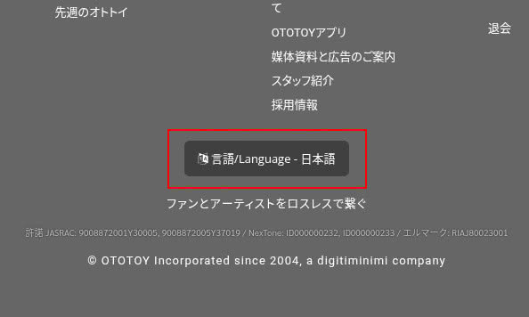

## ขั้นตอนการซื้อ

เว็บ Ototoy สามารถซื้อเพลงแบบไม่ต้องสมัครบัญชีได้แต่ก็จะมีข้อจำกัดบางอย่าง แนะนำให้สมัครสมาชิกไว้เลยดีกว่าครับ เพลงจะได้เข้ามาอยู่บัญชีเราเลยจะฟังจะโหลดจะได้ทำง่ายๆ  เมนูสมัครจะอยู่ด้านขวาบน Guest > Sign Up วิธีการสมัครผมขอข้ามไปนะสมัครไม่ยากคิดว่าน่าจะทำกันได้อยู่แล้ว ขั้นตอนนี้เราสามารถทำได้เลยไม่ต้องใช้ VPN

1. ถ้ามีบัญชีแล้วก็กด Sign In เข้าสู่ระบบมาเลยครับ
2. เลือกเพลงที่เราอยากจะซื้อ แต่ละเพลงจะมีให้เรากดทดลองฟัง ลองฟังดูก่อนได้
3. ดูข้อจำกัดของแต่ละเพลง บางเพลงจะมีข้อจำกัดบางอย่างตามนี้ครับ

	**Audio format**

	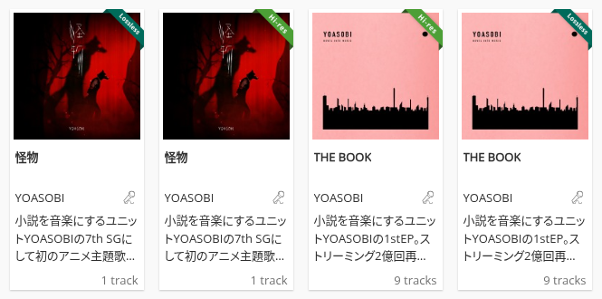

	Audio format: Hi-res, Lossless

	ผมไม่ค่อยมีคามรู้เรื่องเสียงเท่าไรเลยอธิบายมากไม่ค่อยได้ แต่ถ้าเอาแบบง่ายๆ ความต่างระหว่าง Hi-res กับ Loessless คือ Hi-res ความละเอียดเสียงจะสูงกว่าครับ แน่นอนว่าราคาก็จะแพงกว่าด้วย ซึ่งบางเพลงอาจจะไม่ได้มีให้เลือกเพราะทำมาแบบเดียว สำหรับใครที่หูไม่ได้เทพแยกเสียงได้ดีขนาดนั้นก็ไม่ต้องคิดมากก็ได้ครับเลือกมาสักอันก็พอ

	**ประเภทไฟล์ที่จะได้**

	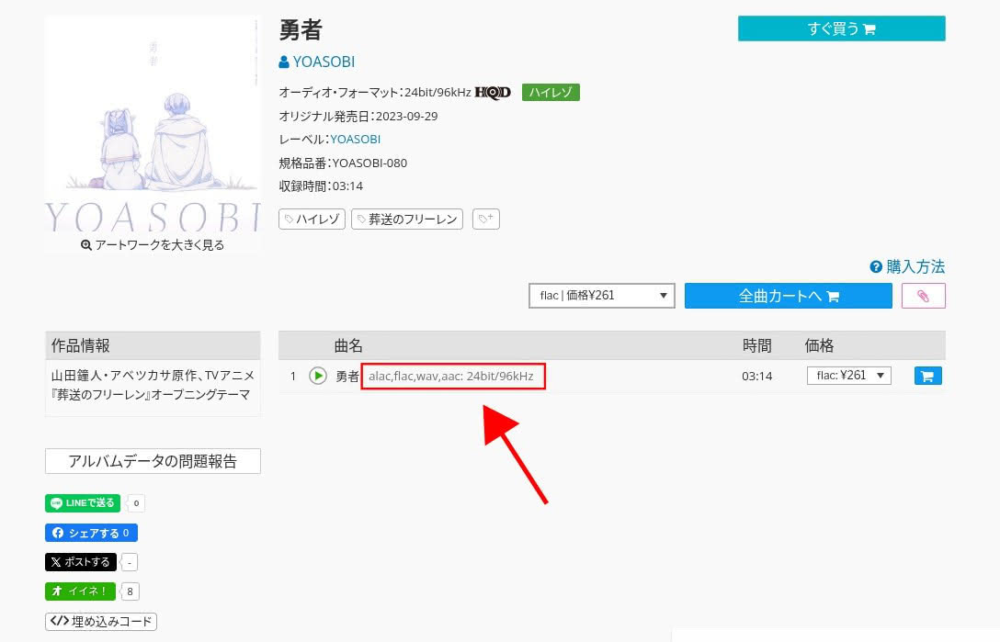

	File type: alac, flac, wave, acc

	แต่ละเพลงจะมีไฟล์ฟอร์แมตให้มาไม่เหมือนกันขึ้นอยู่กับว่าอัพโหลดฟอร์แมตไหนบ้าง แต่ส่วนใหญ่จะมี flac มาให้ซึ่งถือว่าครอบคลุมแล้ว ไม่รู้จะแบบไหนก็เลือก flac มาก่อนก็ได้ครับ ประเภทไฟล์เราสามารถกลับมาเปลี่ยนทีหลังได้ครับ

	**จำนวนครั้งที่โหลดไฟล์ได้**

	หลายๆ เพลงตัวเจ้าของลิขสิทธิ์จะจำกัดจำนวนครั้งที่โหลดไฟล์เอาไว้ ถ้าเพลงมีการจำกัดจำนวนดาวน์โหลดแนะนำว่าให้โหลดมาหนึ่งครั้งแล้วแบ็คอัพเก็บไว้ครับ อัพลง Google drive/Onedrive/Apple cloud ส่วนตัว หลังจากนั้นเวลาอยากจะโหลดมาก็โหลดจากไฟล์ที่อยู่ใน cloud ตัวเองครับ จะได้ไม่โดนนับครั้งโหลด

	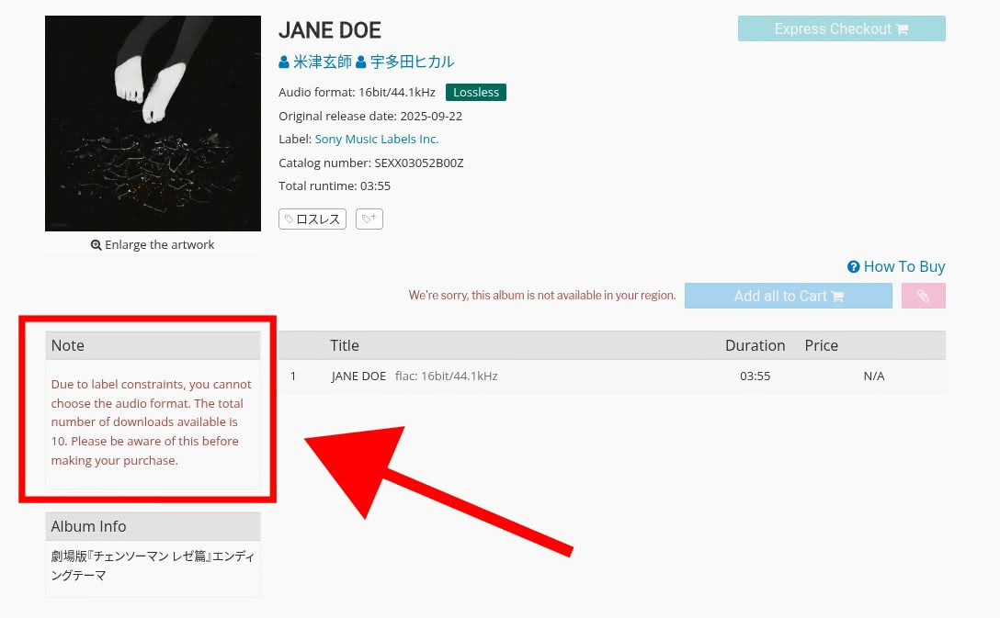

	**Region-lock**
	
	บางเพลงจะซื้อนอกญี่ปุ่นไม่ได้ครับ
	วิธีสังเกตง่ายๆ คือ ถ้าเข้าไปแล้วกดฟังเพลงไม่ได้หรือมีข้อความ "We're sorry, this album is not available in your region" จะเป็นแบบ Region-lock ครับ ซื้อได้แค่ที่ญี่ปุ่นเท่านั้น (แต่ใช้ VPN ช่วยได้)

	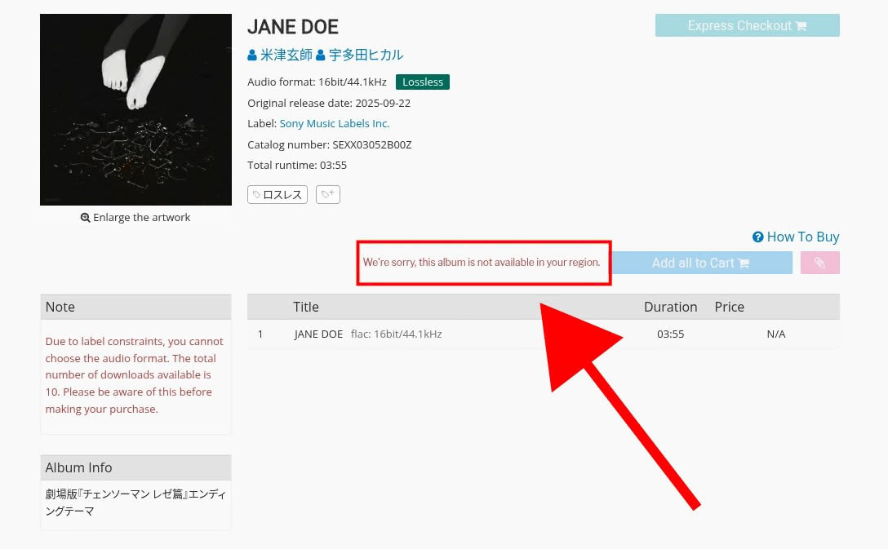

4. ถ้าเพลงที่เราจะซื้อติด region-lock เราต้องใช้ VPN ไปที่ญี่ปุ่นครับ ส่วนตัวผมใช้ [ProtonVPN](https://pr.tn/ref/5DEAYTRT) (เสียเงิน) หรือจะใช้ VPN ฟรีเจ้าอื่นก็ได้ครับขอแค่ต่อไปญี่ปุ่นได้

	ต้องเปิด VPN ตั้งแต่หน้าเลือกเพลงนะครับไม่งั้นกดเลือกเพลงเข้าตระกร้าไม่ได้ ใครเปิด VPN ทีหลังให้ refresh หน้าหนึ่งทีครับกดเลือกตระกร้าถึงจะกดได้ 

	
VPN ใช้แค่ตอนเลือกเพลงเข้าตระกร้าจนถึงตอนจ่ายเงินเสร็จเท่านั้นครับ หลังจากนั้นจะฟังจะโหลดสามารถทำได้โดยไม่ต้องใช้ VPN แล้ว
	

5. พอเจอเพลงที่ถูกใจแล้ว
	1. กดเลือก file format ที่ต้องการ
	2. กดเพิ่มเเข้าตระกร้า

	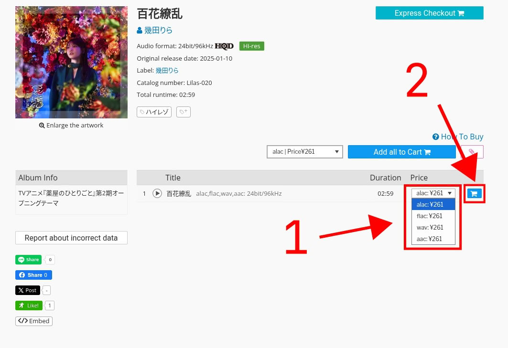

	หรือถ้าอยากซื้อทั้งอัลบั้มก็ได้เหมือนกัน

	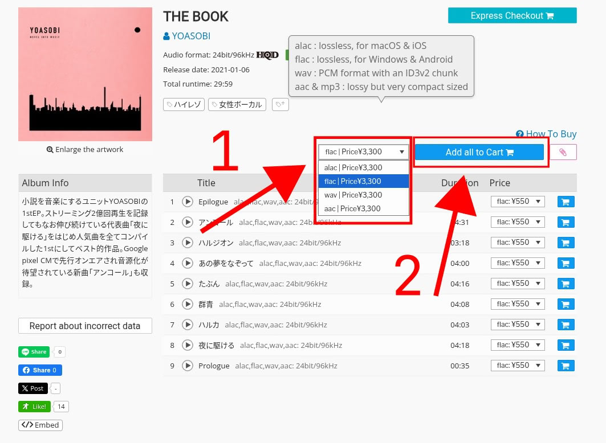
6. พอเลือกเพลงที่ต้องเข้าตระกร้าครบแล้วก็ไปหน้าตระกร้าได้เลย เมนูจะอยู่ด้านบนขวาชื่อ `Cart`
7. หน้าตระกร้าก็ตรวจสอบข้อมูลให้เรียบร้อย ถ้าทุกอย่างโอเคก็ checkout ได้เลย 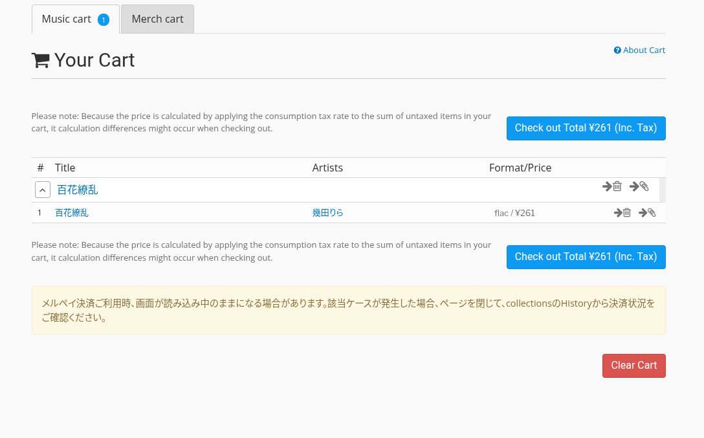
8. เว็บจะให้เข้าใส่รหัสผ่านยืนยันอีกครั้งก็ใส่ไปครับ 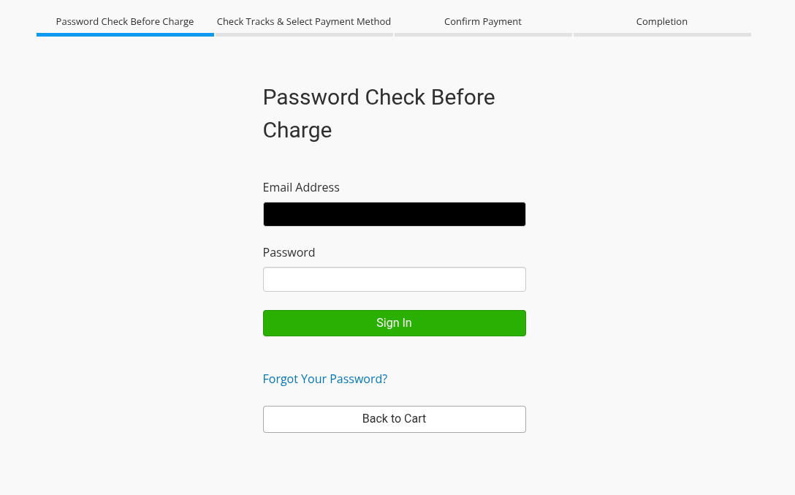
9. ต่อมาก็เลือกวิธีจ่ายเงิน ตรงนี้กดเลือก "By Credit card" ได้เลยครับ ใช้ได้ทั้ง Debit card และ Credit card ที่ออกโดยธนาคารประเทศไทย ไม่จำเป็นต้องเป็นบัตรต่างประเทศ แต่อย่าลืมเปิดให้จ่ายออนไลน์ได้ด้วยนะครับ ตรงนี้ใครไม่มีบัตรลองสมัครใช้พวก Virtual card อย่าง KTB Fun หรือ True money virtual card แทนเอาก็ได้ครับ 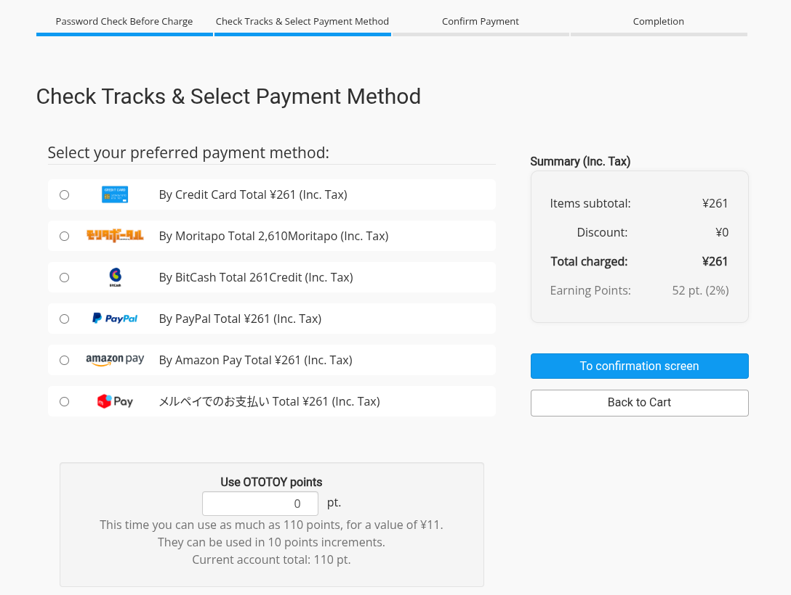

	ส่วนด้านล่างจะเป็น OTOTOY Points ถ้าใครมี point สามารถเอา point มาเป็นส่วนลดได้

	ถ้าทุกอย่างโอเคแล้วกด confirm ได้เลย

10. ถัดไปจะเป็นหน้าให้กรอกข้อมูลบัตรครับ บัญชีผมมีข้อมูลบัตรไว้อยู่แล้วหน้านี้เลยแค่คอนเฟิร์ม CCV ใครที่ทำครั้งแรกก็กรอกข้อมูลบัตรให้ครบ ส่วนตรง `What type of your computer?` ให้เลือกอันที่เป็น `UTF-8` ครับ 

 	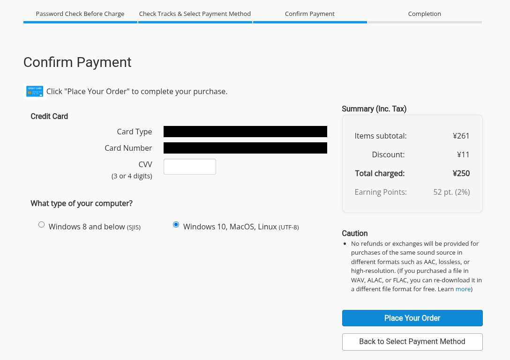

	เสร็จแล้วก็กด `Place Your Order` ได้เลย

11. ซื้อเสร็จแล้ว ถึงขั้นตอนนี้ถ้าใช้ VPN สามารถปิดได้เลยครับ 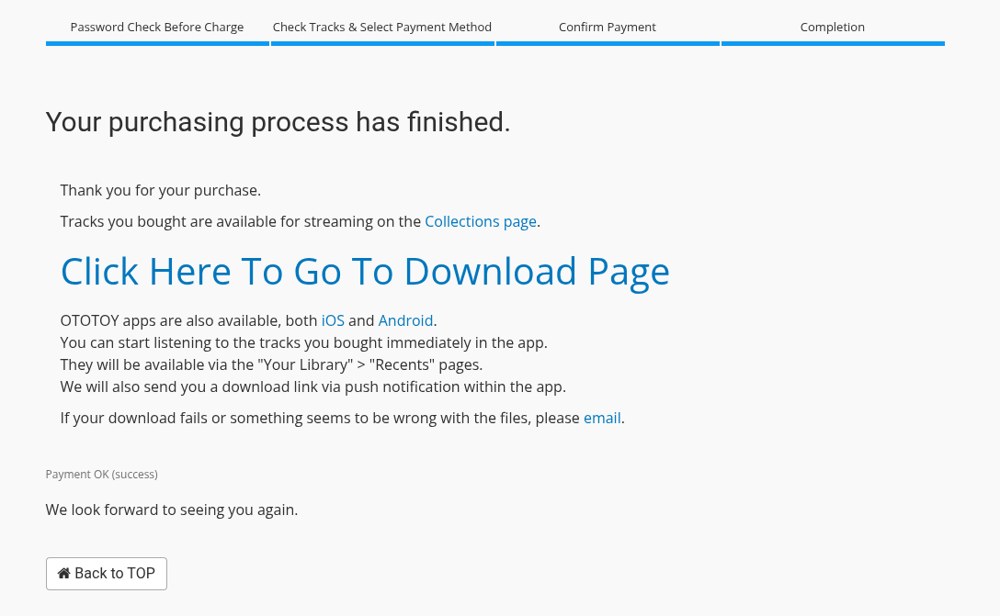

## วิธีโหลดเพลง

1. ด้านบนขวากดเมนู collection จะเข้ามาหน้า Library 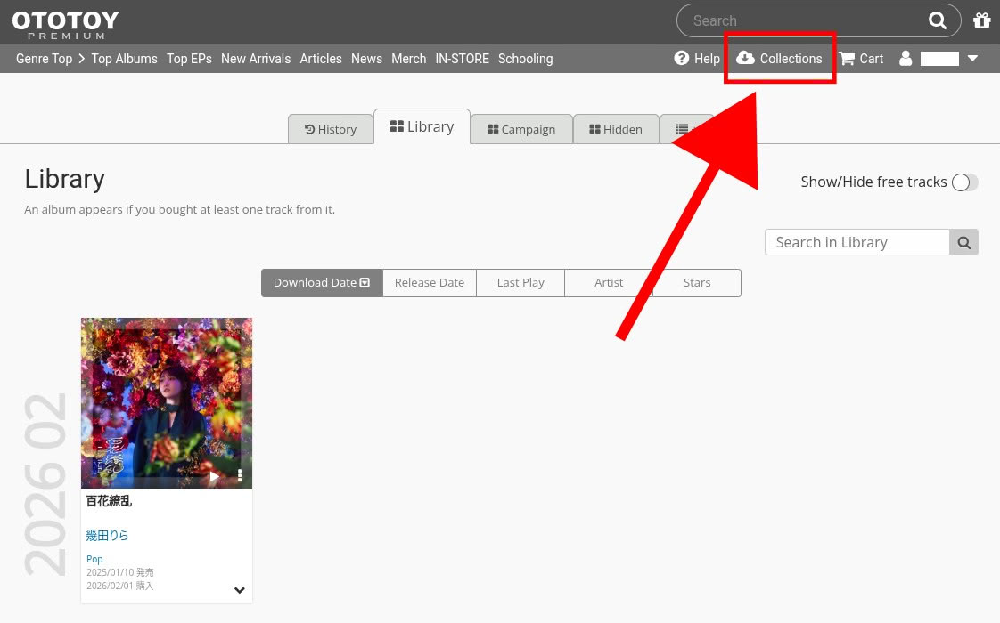
2. ตรงเพลง
	1. กดตรงลูกศร 
	2. แล้วจะมีปุ่มดาวน์โหลดรูปก้อนเมฆโผล่ออกมาครับ กดตรงปุ่มก้อนเมฆเพื่อโหลดได้เลย 

	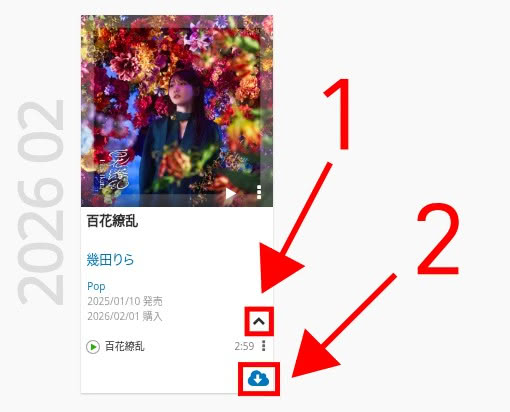

3. เท่านี้ก็จะได้ไฟล์ zip มา แตกไฟล์ก็ฟังเพลงได้เลยครับ 

	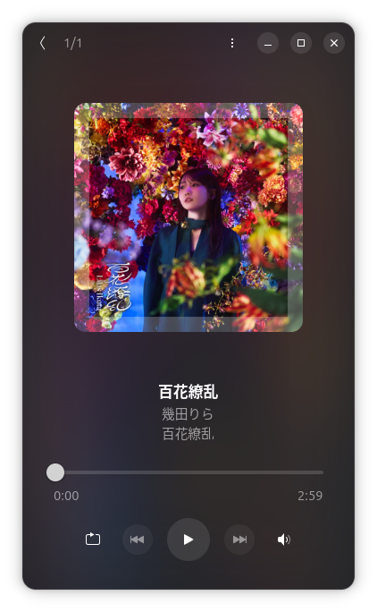

## วิธีเปลี่ยน File format

สำหรับเพลงที่มี file format หลายๆ แบบให้เลือก แล้วเราอยากเปลี่ยนทีหลังให้ทำตามดังนี้ครับ

1. กดไปหน้าข้อมูลเพลงนั้นๆ
2. ตรง Price กดเลือก file format ที่ต้องการ แล้วกดเพิ่มเข้าตระกร้าเลยครับ
	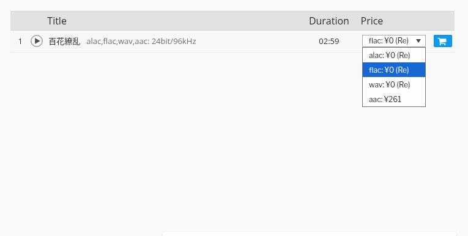
3. เสร็จแล้วกดไปที่ Cart แล้ว checkout ไปเลยครับ เป็นหน้า checkout ก็จริงแต่ราคา 0 เยนไม่คิดเงิน
	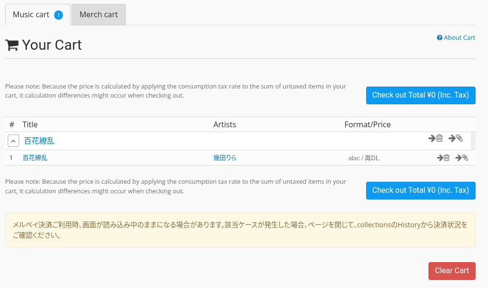
4. หน้าถัดมาจะเป็นหน้าจ่ายเงินก็เลือกแบบฟรีไปเลยเพราะครับไม่เสียเงินอยู่แล้ว
	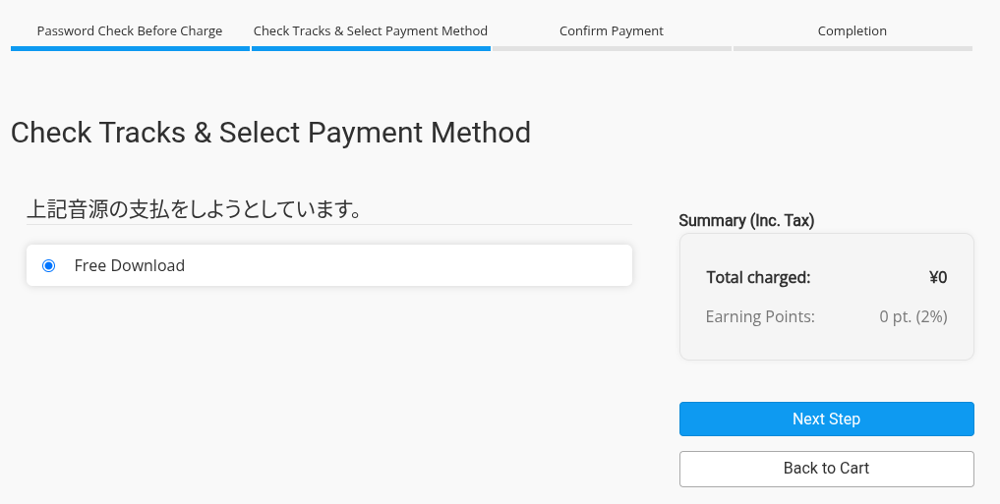
5. ที่เหลือก็ทำเหมือนตอนซื้อเพลงเลยครับ
6. พอทำทุกอย่างเสร็จแล้ว เวลากดไปหน้า collection แล้วกดดาวน์โหลดเราก็จะได้ไฟล์เพลงอันใหม่ที่เราเลือกแล้วครับ

	ส่วนวิธีเช็คว่าตอนนี้เป็น file format ไหนอยู่ ให้กดตรงจุด 3 จุด > track info > format
	

จบแล้วครับเท่านี้เราก็มีไฟล์เพลงที่เอาไปฟังที่ไหนได้แล้วครับ แต่อย่าเอาไฟล์ไปแจกใครนะครับแบบนั้นผิดลิขสิทธิ์ ตามลิขสิทธิ์แล้วไฟล์จะใช้ได้เฉพาะกับเราเท่านั้นห้ามเอาไปแจกหรือส่งต่อใคร 
