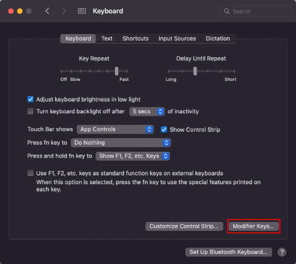

ถ้าให้เทียบความถี่ในการกดปุ่ม เชื่อว่าปุ่ม Caps Lock คงเป็นปุ่มที่กดน้อยเป็นอันดับต้นๆ แน่เลย ต่างกับปุ่ม Esc หรือ Escape ที่ดูจะกดบ่อยกว่าเห็นๆ ยิ่งถ้าพูดถึงคนที่ใช้ vim เป็นประจำปุ่ม Esc กดเป็นว่าเล่นกันเลยทีเดียว

แต่ปุ่ม Esc นี้มันอยู่ไกลกดลำบาก ต้องเอื้อมนิ้วไม่ก็มือขึ้นไปกด เทียบกับปุ่ม Caps Lock ที่อยู่แถวเดียวกับ `ASDF JKL:` แถวสำหรับวางมือตอนพิมพ์สัมผัสอยู่แล้ว เอื้อมนิ่วก้อยมือซ้ายไปกดง่ายกว่า

โพสต์นี้เลยจะมาบอกวิธีเปลี่ยนปุ่ม Caps Lock ที่ไม่ได้ใช้บ่อยๆ ให้กลายเป็นปุ่ม Esc แทนจะได้กดง่ายๆ

## Windows

เนื่องจาก Windows ไม่สามารถปรับปุ่มได้เองเลยต้องใช้โปรแกรมช่วย ซึ่งเราสามารถใช้โปรแกรม PowerToys ที่ Microsoft เป็นคนทำในการปรับปุ่มได้

โปรแกรม PowerToys ใช้ได้เฉพาะ Windows 10 (v1903 (18362) หรือใหม่กว่านั้น) และ Windows 11 ขึ้นไป ใครใช้ Windows เวอร์ชันเก่ากว่านี้เสียใจด้วยครับ ;-; (แต่เอาจริงๆ Windows เก่านี้ Microsoft เองก็เลิกซัพพอร์ตแล้ว เพราะงั้นใครที่ใช้อยู่แนะนำให้อัพเดทเป็นเวอร์ชันใหม่ดีกว่า)

### ติดตั้ง PowerToys

โปรแกรม PowerToys เองสามารถลงได้ 2 วิธี ดังต่อไปนี้

**วิธีที่ 1 ติดตั้งผ่าน winget**

ใครยังไม่เคยใช้ winget สามารถอ่านโพสต์เก่าที่ผมเคยเขียนไว้ได้ที่ [Winget คืออะไร? พร้อมวิธีติดตั้งและใช้งาน]()

```bat
winget install Microsoft.PowerToys -s winget
```

**วิธีที่ 2 ติดตั้งผ่านทาง Microsoft Store**

1. เปิดโปรแกรม Microsoft Store ขึ้น
2. ค้นหาว่า `PowerToys` หรือ[กดจากลิงก์นี้](https://aka.ms/getPowertoys)
3. กดติดตั้งเป็นอันเสร็จสิ้น


### ปรับปุ่ม

ลงโปรแกรมเสร็ตแล้วมาปรับปุ่มกัน

1. เริ่มจากเปิดโปรแกรมก่อนเลย
2. จากนั้นกดเมนูด้านซ้ายมือที่ชื่อว่า `Keyboard Manager`
3. กดปุ่ม `Remap a key`
   

4. จะมีหน้าต่างเปิดใหม่ขึ้นมาใช้สำหรับตั้งค่าปุ่ม
5. กดเมนูที่เครื่องหมาย `+` เพื่อตั้งค่าปุ่มใหม่
6. เราอยากเปลี่ยนให้กดปุ่ม `Caps Lock` เป็นปุ่ม `Esc` แทนก็ตั้งตามนี้

   - Physical Key ให้เป็น Caps Lock
   - Mapped To ให้เป็น Esc

   
   ตอนเลือกปุ่มที่เป็น Dropdown ที่มีปุ่มเยอะทำให้หายาก เราสามารถพิมพ์ชื่อปุ่มได้แทนที่การเลื่อนหาปุ่มเองได้ เช่น Caps Lock ให้พิมพ์ Ca หรือ Esc ก็พิมพ์แค่ Es
   

   

7. ตั้งค่าเสร็จกด OK
8. จะมีหน้าต่างขึ้นมายืนยันกด `Continue anywhere` ได้เลย
9. แค่นี้ก็เสร็จเรียบร้อย เราก็สามารถกด Caps Lock แทนปุ่ม Esc ได้แล้ว


เราจำเป็นจะต้องเปิด PowerToys ไว้ตลอดเพื่อให้ตั้งค่าทำงาน ถ้าใครไม่อยากให้โปรแกรมรกตรง Taskbar ให้กดปิด (Close) โปรแกรมไปได้เลย เดี๋ยว PowerToys จะซ่อนตัวเองไปอยู่ตรง tray bar แทน ขอแค่ไม่คลิกขวาไป Exit โปรแกรมก็พอ


## macOS

สำหรับ macOS สามารถตั้งค่าจาก OS ได้เลยไม่ต้องพึ่งโปรแกรมเสริม เริ่มจาก
1. เปิด `System Preferences` ขึ้นมา
2. กดไปที่ `Keyboard`
   
3. กดไปที่ `Modifier Keys`
	
4. ปรับปุ่ม `Caps Lock` ให้เป็น `Esc`

	
5. กดโอเค แค่นี้ก็เรียบร้อยใช้งานได้เลย!
