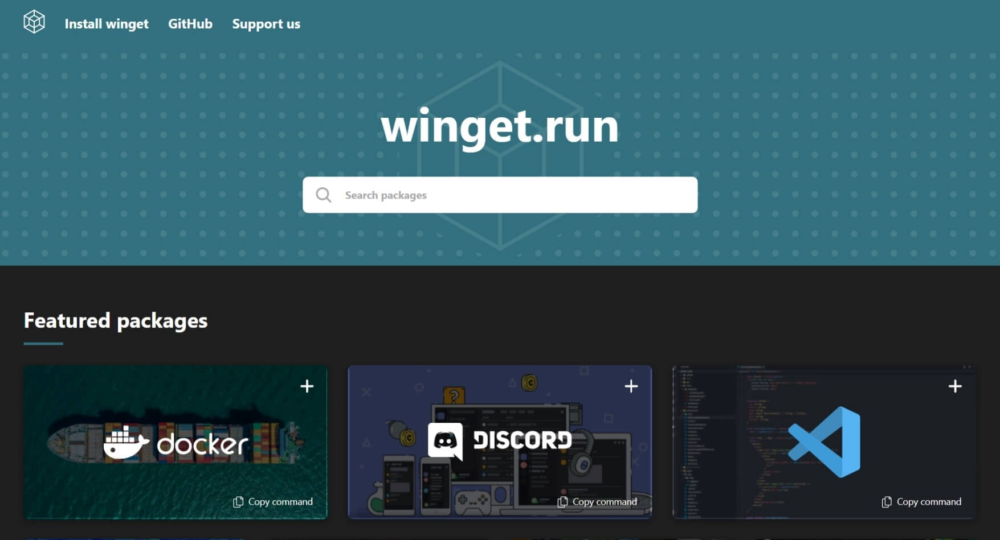
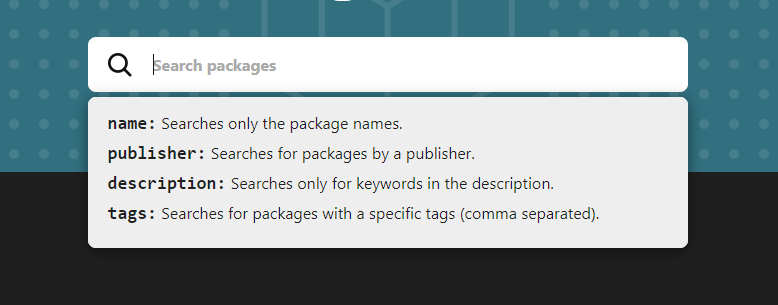
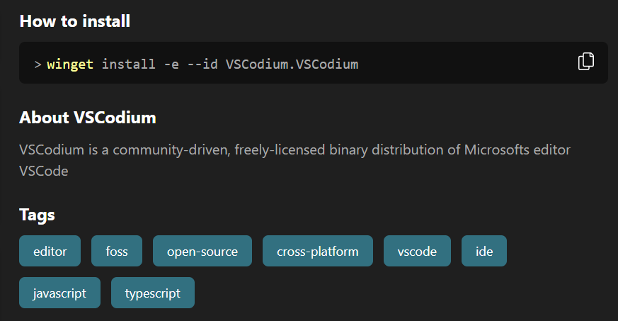
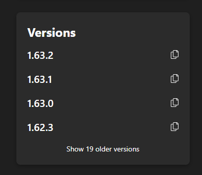

เวลาใช้ [Winget]() เราก็ต้องทำทุกอย่างผ่าน CLI (Command line interface) ใช่ไหมละ แล้วถ้าอยากลองค้นหาแพ็คเกจก็ต้องพิมพ์คำสั่งแบบนี้

```bat
winget search <query>
```

เช่น
```bat
winget search vscode
```

ผลลัพธ์ก็จะได้ประมาณนี้

```bat
Name                                  Id                                  Version      Match                    Source
----------------------------------------------------------------------------------------------------------------------
Microsoft Visual Studio Code          Microsoft.VisualStudioCode          1.64.0       Moniker: vscode          winget
MrCode                                zokugun.MrCode                      1.62.3.21323 Tag: vscode              winget
VSCodium                              VSCodium.VSCodium                   1.64.0       Tag: vscode              winget
微信开发者工具                        Tencent.wechat-devtool              1.05.2108130 Tag: vscode              winget
Huawei QuickApp IDE                   Huawei.QuickAppIde                  11.4.2       Tag: vscode              winget
TheiaBlueprint                        EclipseFoundation.TheiaBlueprint    1.16.0       Tag: vscode              winget
Microsoft Visual Studio Code Insiders Microsoft.VisualStudioCode.Insiders 1.65.0       Moniker: vscode-insiders winget
```

แต่มันอ่านยากแถมใช้ไม่ค่อยสะดวกด้วย อย่างลอง search ด้วย `winget search chat` ดูแล้วจะพบกับผลลัพธ์ที่ยาวถึง 80 บรรทัด 😱

เลยมีคนทำ [Winget.run](https://winget.run) ขึ้นมาจะได้ค้นหากันง่ายๆ ซึ่งตัวเว็บนี้เนี่ยเขาทำช่องค้นหามาให้แล้วอยากได้ package แบบไหนก็พิมพ์ค้นได้เลย



ช่องค้นหายังเติม prefix ได้ด้วยเอาไว้เจาะจงผลลัพธ์ให้ตรงที่เราต้องการมากขึ้น เช่น ถ้าอยากค้นหาด้วยแท็กก็พิมพ์ `tags:` ไว้ข้างหน้าแล้วตามด้วยแท็กที่อยากค้น



พอกดเข้าดูหน้า package ก็จะมีคำอธิบายว่าแพ็คเกจนั้นเกี่ยวกับอะไร ถ้าอยากลงก็มีคำสั่งพร้อมให้ก็อปไปใช้ได้เลย จะได้ไม่ต้องมาพิมพ์คำสั่ง install เอง



ด้านข้างก็มีเวอร์ชันที่โหลดได้ให้ดูด้วย อยากลงเวอร์ชันนั้นจิ้มปุ่มก็อปด้านขวาก็จะได้คำสั่งสำหรับลงเวอร์ชันนั้นมา



สุดท้ายนี้ตัว Winget.run เองไม่ได้เป็นเว็บไซต์ทางการ (Official) จาก Microsoft นะ ใครที่อยากให้มีเว็บดีๆ แบบนี้ให้ใช้ไปนานๆ ก็อย่าลืมไป[โดเนทช่วยค่าเซิฟเวอร์](https://ko-fi.com/wingetdotrun)ด้วยละ Winget.run เองยังอัพซอร์สไว้บน [Github](https://github.com/winget-run/wingetdotrun) ด้วยไปดูกันได้ (ปล. ถึงแม้อัพโค้ดไว้บน Github ก็จริง แต่ไม่ได้กำหนด License ไว้ ถ้าจะเอาไปทำอะไรก็ระวังด้วยละ)
